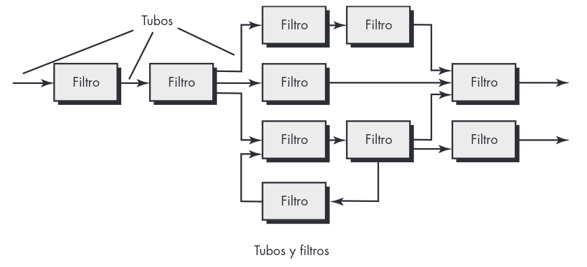
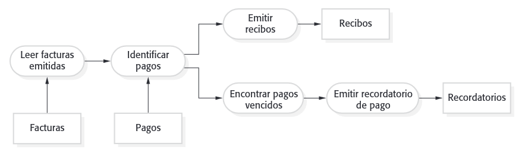

# Pipe filter

**Arquitecturas de flujo de datos.** Esta arquitectura se aplica cuando datos de entrada van a transformarse en datos de salida a través de una serie de componentes computacionales o manipuladores. Un patrón de tubo y filtro tiene un conjunto de componentes, llamados filtros, conectados por tubos que transmiten datos de un componente al siguiente.

Cada filtro trabaja en forma independiente de aquellos componentes que se localizan arriba o abajo del flujo; se diseña para esperar una entrada de datos de cierta forma y produce datos de salida (al filtro siguiente) en una forma especificada. Sin embargo, el filtro no requiere ningún conocimiento de los trabajos que realizan los filtros vecinos. 

Si el flujo de datos degenera en una sola línea de transformaciones, se denomina lote secuencial. Esta estructura acepta un lote de datos y luego aplica una serie de componentes secuenciales (filtros) para transformarlos.

Tubo y filtros

El patrón tubería y filtro (pipe and filter) es un modelo de la organización en tiempo de operación de un sistema, donde las transformaciones funcionales procesan sus entradas y producen salidas. Los datos fluyen de uno a otro y se transforman conforme se desplazan a través de la secuencia. Cada paso de procesamiento se implementa como un transformador. Los datos de entrada fluyen por medio de dichos transformadores hasta que se convierten en salida. Las transformaciones pueden ejecutarse secuencialmente o en forma paralela. Es posible que los datos se procesen por cada transformador ítem por ítem o en un solo lote.

El nombre “tubería y filtro” proviene del sistema Unix original, donde era posible vincular procesos empleando “tuberías”. Por ellas pasaba una secuencia de texto de un proceso a otro. Los sistemas conformados con este modelo pueden implementarse al combinar comandos Unix, usando las tuberías y las instalaciones de control del intérprete de comandos Unix. Se usa el término “filtro” porque una transformación “filtra” los datos que puede procesar de su secuencia de datos de entrada.

Se han utilizado variantes de este patrón desde que se usaron por primera vez computadoras para el procesamiento automático de datos. Cuando las transformaciones son secuenciales, con datos procesados en lotes, este modelo arquitectónico de tubería y filtro se convierte en un modelo secuencial en lote, una arquitectura común para sistemas de procesamiento de datos (por ejemplo, un sistema de facturación). La arquitectura de un sistema embebido puede organizarse también como un proceso por entubamiento, donde cada proceso se ejecuta de manera concurrente.

Los sistemas interactivos son difíciles de escribir con el modelo tubería y filtro, debido a la necesidad de procesar una secuencia de datos. Aunque las entradas y salidas textuales simples pueden modelarse de esta forma, las interfaces gráficas de usuario tienen formatos I/O más complejos, así como una estrategia de control que se basa en eventos como clics del mouse o selecciones del menú. Es difícil traducir esto en una forma compatible con el modelo pipelining (entubamiento).

## Descripción

El procesamiento de datos en un sistema se organiza de forma que cada componente de procesamiento (filtro) sea discreto y realice un tipo de transformación de datos. Los datos fluyen (como en una tubería) de un componente a otro para su procesamiento.

## Ejemplo

En la figura se muestra un ejemplo de este tipo de arquitectura de sistema, que se usa en una aplicación de procesamiento en lote. Una organización emite facturas a los clientes. Una vez a la semana, los pagos efectuados se incorporan a las facturas. Para as facturas pagadas se emite un recibo. Para las facturas no saldadas dentro del plazo de
pago se emite un recordatorio.

## Cuándo se usa 

Se suele utilizar en aplicaciones de procesamiento de datos (tanto basadas en lotes [batch] como en transacciones), donde las entradas se procesan en etapas separadas para generar salidas relacionadas.

## Ventajas

Fácil de entender y soporta reutilización de transformación. El estilo del flujo de trabajo coincide
con la estructura de muchos procesos empresariales. La evolución al agregar transformaciones
es directa. Puede implementarse como un sistema secuencial o como uno concurrente.

## Desventajas

El formato para la transferencia de datos debe acordarse entre las transformaciones que se comunican. Cada transformación debe analizar sus entradas y sintetizar sus salidas al formato acordado. Esto aumenta la carga del sistema, y puede significar que sea imposible reutilizar transformaciones funcionales que usen estructuras de datos incompatibles.

## Fuentes

1. **Pressman, Roger S.**  
   *Ingeniería del Software: Un Enfoque Práctico.* 7ª edición.  
   McGraw-Hill, 2014.  

2. **Sommerville, Ian.**  
   *Ingeniería de Software.* 9ª edición.  
   Addison-Wesley, 2011.
