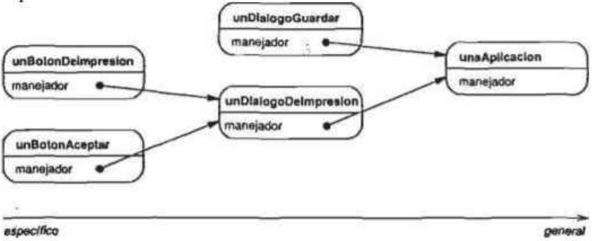
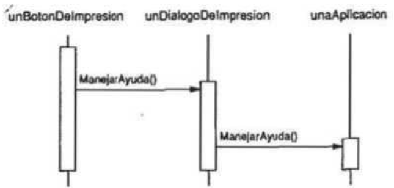
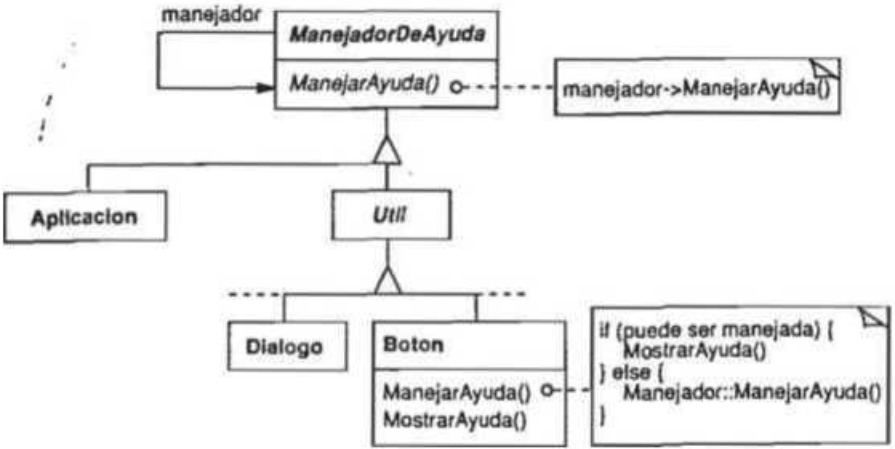
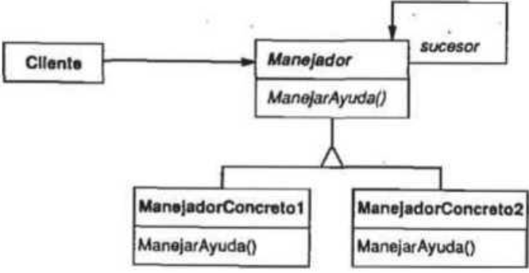
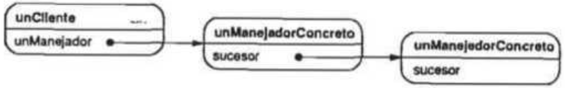

# Cadena de responsabilidad

- Objetos de comando que son manejados o pasados a otros objetos por medio de otros que contienen procesamiento lógico.

- El patrón Chain of Responsibility proporciona un acoplamiento aún más bajo. Permite enviar peticiones a un objeto implícitamente, a través de una cadena de objetos candidatos. Cualquier candidato puede satisfacer la petición dependiendo-de una serie de condiciones en tiempo de ejecución. El número de candidatos es indeterminado, y se puede seleccionar en tiempo de ejecución qué candidatos participan en la cadena.

## Propósito

Evita acoplar el emisor de una petición a su receptor, dando a más de un objeto la posibilidad de responder a la petición. Encadena los objetos receptores y pasa la petición a través de la cadena hasta que es procesada por algún objeto.

## Motivación

Supongamos un servicio de ayuda sensible al contexto para una interfaz gráfica de usuario. El usuario puede obtener información de ayuda en cualquier parte de la interfaz simplemente pulsando con el ratón sobre ella. La ayuda proporcionada depende de Iq parte de la interfaz que se haya seleccionado así como de su contexto; por ejemplo, un botón de un cuadro de diálogo puede tener diferente informa-
ción de ayuda que un botón similar de la ventana principal. Si no existe información de ayuda específica para esa parte de la interfaz el sistema de ayuda debería mostrar un mensaje de ayuda más general sobre el contexto inmediato, por ejemplo, sobre el cuadro de diálogo en sí. De ahí que sea natural organizar la información de ayuda de acuerdo con su generalidad -de lo más específico a lo más general-. Además, está claro que una petición de ayuda es manejada por un objeto entre varios de la interfaz de usuario; el objeto concreto depende del contexto y de la especificidad de la ayuda disponible.
El problema es que el objeto que en última instancia *proporciona* la ayuda no conoce explícitamente al objeto (por ejemplo, el botón) que *inicializa* la petición de ayuda. Necesitamos un modo de desacoplar el botón que da lugar a la petición de ayuda de los objetos que podrían proporcionar dicha información. El patrón Chain of Responsibility define cómo hacer esto.
La idea de este patrón es desacoplar a los emisores y a los receptores dándole a varios objetos la posibilidad de tratar una petición. La petición se pasa a través de una cadena de objetos hasta que es procesada por uno de ellos.



El primer objeto de la cadena recibe la petición y, o bien la procesa o bien la redirigc al siguiente candidato en la cadena, el cual hace lo mismo. El objeto que hizo la petición no tiene un conocimiento explícito de quién la tratará -decimos que la petición tiene un receptor implícito-.

Supongamos que el usuario solicita ayuda sobre un botón denominado “Imprimir”. El botón se encuentra en una instancia de DialogoDelmpresion, que sabe a qué objeto de aplicación pertenece (véase el diagrama de objetos precedente). El siguiente diagrama de interacción ilustra cómo la petición de ayuda se reenvía a través de la cadena:



En este caso, la petición no es procesada ni por `unBotonDelmpresion` ni por `unDialogoDelmpresion`; se detiene en `unaAplicacion`, quien puede procesarla u obviarla. El cliente que dio origen a la petición no tiene ninguna referencia directa al objeto que finalmente la satisface.

Para reenviar la petición a lo largo de la cadena, y para garantizar que los receptores permanecen implícitos, cada objeto,de la cadena comparte una interfaz común para procesar peticiones y para acceder a su sucesor eri la cadena. Por ejemplo, el sistema de ayuda podría definir una clase `ManejadorDcAyuda` con su correspondiente operación `ManejarAyuda`. ManejadorDeAyuda puede ser la clase padre de las clases de objetos candidatos, o bien puede ser definida como una clase mezclable. Entonces las clases que quieran manejar peticiones de ayuda pueden hacer que `ManejadorDeAyuda` sea uno de sus padres:



Las clases `Boton`, `Dialogo` y `Aplicación` usan las operaciones de `ManejadorDeAyuda` para tratar peticiones de ayuda. La operación ManejarAyuda de `ManejadorDeAyuda` reenvía la petición al sucesor de manera predeterminada. Las subclases pueden redefmir esta operación para proporcionar ayuda en determinadas circunstancias; en caso contrario, pueden usar la implementación predeterminada para reenviar la petición.

## Aplicabilidad

Úsese el patrón Chain of Responsibility cuando

- hay más de un objeto que pueden manejar una petición, y el manejador no se conoce *a priori*, sino que debería determinarse automáticamente
- se quiere enviar una petición a un objeto entre varios sin especificar explícitamente el receptor.
- el conjunto de objetos que pueden tratar una petición debería ser especificado dinámicamente.

## Estructura



Una estructura de objetos típica podría parecerse a ésta:



## Participantes

- `Manejador` (`ManejadorDeAyuda`)
  - define una interfaz para tratar las peticiones.
  - (opcional) implementa el enlace al sucesor.
- `ManejadorConcreto` (BotonDelmpresion, DialogoDelmpresion)
  - trata las peticiones de las que es responsable.
  - puede acceder a su sucesor.
  - si el `ManejadorConcreto` puede manejar la petición, lo hace; en caso contrario la reenvía a susucesor.
- Cliente
  - inicializa la petición a un objeto `ManejadorConcreto` de la cadena.

## Colaboraciones

Cuando un cliente envía una petición, ésta se propaga a través de la cadena hasta que un objeto `ManejadorConcreto` se hace responsable de procesarla.

## Consecuencias

Este patrón tiene las siguientes ventajas e inconvenientes:

1. Reduce el acoplamiento. 
   - El patrón libera a un objeto de tener que saber qué otro objeto maneja una petición. Un objeto sólo tiene que saber que una petición será manejada “de forma apiopiada". Ni el receptor ni el emisor se conocen explícitamente entre ellos, y un objeto de la cadena tampoco tiene que conocer la estructura de ésta.
   - Como resultado, la Cadena de Responsabilidad puede simplificar las interconexiones entre objetos. En vez de que los objetos mantengan referencias a todos los posibles receptores, sólo tienen una única referencia a su sucesor.
2. Añade flexibilidad para asignar responsabilidades a objetos.
   - La Cadena de Responsabilidad ofrece una flexibilidad añadida para repartir responsabilidades entre objetos. Se pueden añadir o cambiar responsabilidades para tratar una petición modificando la cadena en tiempo de ejecución. Esto se puede combinar con la herencia para especializar los manejadores estáticamente.
3. No se garantiza la recepción. 
   - Dado que las peticiones no tienen un receptor explícito, no hay garantía de que sean manejadas -la petición puede alcanzar el final de la cadena sin haber sido procesada-. Una petición también puede quedar sin tratar cuando la cadena no está configurada correctamente.

## Implementación

Éstos son algunos Retalles de implementación a tener en cuenta sobre la Cadena de Responsabilidad:

1. *Implementación de la cadena sucesora*. Hay dos formas posibles de ímplementar la cadena sucesora:

  - Definir nuevos enlaces (normalmente en el `Manejador`, pero también podría ser en los objetos `ManejadorConcreto`).
  
  - Usar los enlaces existentes. Los ejemplos mostrados hasta ahora definen nuevos enlaces, pero muchas veces se pueden usar referencias a objetos existentes para formar la cadena sucesora. Por ejemplo, las referencias al padre en una jerarquía de parte-todo pueden definir el sucesor de una parte. Una estructura de útil puede que ya tenga dichos enlaces. El patrón Composite describe las referencias al padre con más detalle. Usar enlaces existentes funciona bien cuando los enlaces permiten la cadena que necesitamos. Nos evita tener que definir explícitamente nuevos enlaces y ahorra espacio. Pero si la estructura no refleja la cadena de responsabilidad que necesita nuestra aplicación habrá que definir enlaces redundantes.

2. *Conexión de los sucesores*. Si no hay referencias preexistentes para definir una cadena, entonces tendremos que introducirlas nosotros mismos. En ese caso, el `Manejador` no sólo define la interfaz para las peticiones, sino que normalmente también se encarga de mantener el sucesor.
Eso permite que el manejador proporcione una implementación predeterminada de ManejarPetición que reenvíe la petición al sucesor (si hay alguno). Si una subclase de `ManejadorConcreto` no está interesada en dicha petición, no tiene que redefinir la operación de reenvío, puesto que la implementación predeterminada la reenvía incondicionalmente.
A continuación se muestra una clase base `ManejadorDeAyuda` que mantiene un enlace al sucesor:

```cpp
class ManejadorDeAyuda
{
public:
    ManejadorDeAyuda(ManejadorDeAyuda *s) : _sucesor(s) {}

    virtual void ManejarAyuda()
    {
        if (_sucesor)
        {
            _sucesor->ManejarAyuda();
        }
    }

private:
    ManejadorDeAyuda *_sucesor;
};
```

3. *Representación de las peticiones*. Hay varias opciones para representar las peticiones. En su forma más simple, una petición es una invocación a una operación insertada en el código, como en el caso de `ManejarAyuda`. Esto resulta conveniente y seguro, pero entonces sólo se pueden reenviar el conjunto prefijado de peticiones que define la clase `Manejador`.
Una alternativa es usar una única función manejadora que reciba un código de petición (por ejemplo, una constante entera o una cadena) como parámetro. Esto permite un número arbitrario de peticiones. El único requisito es que el emisor y el receptor se pongan de acuerdo sobre cómo debe codificarse la petición.
Este enfoque es más flexible, pero requiere sentencias condicionales para despachar la petición en función de su código. Y, lo que es peor, no hay un modo de pasar los parámetros seguro con respecto al tipo, por lo que éstos deben ser empaquetados y desempaquetados manualmente. Obviamente, esto es menos seguro que invocar una operación directamente.
Para resolver el problema del paso de parámetros, podemos usar para las peticiones *objetos* aparte que incluyan los parámetros de la petición. Una clase `Petición` puede representar peticiones explícitamente, y se pueden definir nuevos tipos de peticiones mediante herencia. Las subclases pueden definir diferentes parámetros. Los manejadores deben conocer el tipo de petición (esto es, qué subclase de `Petición` están usando) para acceder a estos parámetros.
Para identificar la petición, `Petición` puede definir una función de acceso que devuelva un identificador para la clase. Por otro lado, el receptor puede usar información de tipos en tiempo de ejecución en caso de que el lenguaje de implementación lo permita.
A continuación, se muestra un esbozo de una función de despacho que usa objetos petición para identificar las peticiones. Una operación `ObtenerTipo` definida en la clase base Petición identifica el tipo de petición:

```cpp
void Manejador::ManejarPeticion(Peticion *laPeticion)
{
    switch (laPeticion->ObtenerTipo())
    {
    case Ayuda:
        // Convierte el argumento al tipo apropiado
        ManejarAyuda((PeticionDeAyuda *)laPeticion);
        break;
    case Impresión:
        ManejarImpresion((PeticionDeImpresion *)laPeticion);
        break;
    default:
        // Manejar otros casos
        break;
    }
}
```

Las subclases pueden extender el despacho redeñniendo `ManejarPeticion`. La subclase maneja sólo aquellas peticiones en las que está interesada; otras peticiones son reenviadas a la clase padre. De esta forma, las subclases efectivamente extienden (en vez de redeftnir) la operación `ManejarPeticion`. Por ejemplo, así es como una subclase `ManejadorExtendido` extiende la versión de `ManejarPeticion` de `Manejador`:

```cpp
class ManejadorExtendido : public Manejador
{
public:
    virtual void ManejarPeticion(Peticion *laPeticion);
};

void ManejadorExtendido::ManejarPeticion(Peticion *laPeticion)
{
    switch (laPeticion->ObtenerTipo())
    {
    case VistaPreliminar:
        // trata la operación VistaPreliminar
        break;
    default:
        // permite que Manejador trate otras peticiones
        Manejador::ManejarPeticion(laPeticion);
        break;
    }
}
```

4. *Reenvío automático en Smalltalk*. Podemos usar el mecanismo de Smalltalk `doesNotUnderstand` para reenviar peticiones. Los mensajes que no tienen su método correspondiente son atrapados en la implementación de `doesNotUnderstand`, que puede ser redeñnida para reenviar el mensaje a un sucesor del objeto. De esa manera no es necesario implementar manualmente el reenvío; la clase maneja sólo la petición en la que está interesada, y deja a `doesNotUnderstand` el reenvío de todas las demás.

## Código de ejemplo

El siguiente ejemplo ilustra cómo una cadena de responsabilidad puede manejar peticiones para un sistema de ayuda en línea como el descrito anteriormente. La petición de ayuda es una operación explícita. Usaremos las referencias al padre existentes en la jerarquía de útiles para propagar peticiones entre útiles de la cadena, y definiremos una referencia en la clase Manejador para propagar las peticiones de ayuda entre los elementos de la cadena que no sean útiles.
La clase `ManejadorDeAyuda` define la interfaz para manejar peticiones de ayuda. Mantiene un tema de ayuda (que, de manera predeterminada, siempre está vacío) y guarda una referencia a su sucesor en la cadena de manejadores de ayuda. La operación principal es `ManejarAyuda`, la cual es redefinida por las subclases. `TieneAyuda` es una operación de conveniencia para comprobar si existe un `Tema` de ayuda asociado.

```cpp
typedef int Tema;
const Tema SIN_TEMA_DE_AYUDA = -1;

class ManejadorDeAyuda
{
public:
    ManejadorDeAyuda(ManejadorDeAyuda *s, Tema t)
        : _sucesor(s), _tema(t) {}

    virtual bool TieneAyuda()
    {
        return _tema != SIN_TEMA_DE_AYUDA;
    }

    virtual void EstablecerManejador(ManejadorDeAyuda *m, Tema t)
    {
        _sucesor = m;
        _tema = t;
    }

    virtual void ManejarAyuda()
    {
        if (_sucesor != nullptr)
        {
            _sucesor->ManejarAyuda();
        }
    }

private:
    ManejadorDeAyuda *_sucesor;
    Tema _tema;
};
```

Todos los útiles son subclases de laclase abstracta `Util`. `Util` es una subclase de `ManejadorDeAyuda`, ya que todos los elementos de la interfaz de usuario pueden tener ayuda asociada a ellos (también po-
dríamos haber usado una implementación basada en una clase mezclable).

```cpp
class Util : public ManejadorDeAyuda
{
protected:
    Util(Util *padre, Tema t = SIN_TEMA_DE_AYUDA);

private:
    Util *_padre;
};

Util::Util(Util *u, Tema t) : ManejadorDeAyuda(u, t), _padre(u) {}
```

En nuestro ejemplo, un botón es el primer manejador de la cadena. La clase Boton es una subclase de Util. El constructor de Boton toma dos parámetros: una referencia al útil que lo contiene y el tema de ayuda.

```cpp
class Boton : public Util
{
public:
    Boton(Util *d, Tema t = SIN_TEMA_DE_AYUDA);

    virtual void ManejarAyuda() override;
};

Boton::Boton(Util *d, Tema t) : Util(d, t) {}

void Boton::ManejarAyuda()
{
}
```

La versión de `ManejarAyuda` de `Boton` en primer lugar comprueba si hay un tema de ayuda para los botones. Si el desarrollador no ha definido ninguno, entonces la petición es reenviada al sucesor
usando la operación `ManejarAyuda` de `ManejadorDeAyuda`. Si hay un tema de ayuda el botón la muestra y termina la búsqueda.

```cpp
Boton::Boton (Util* h, Tema t) : Util(h, t) { }
void Boton::ManejarAyuda () {
if (TieneAyuda))) {
// ofrecer ayuda sobre el botón
} else {
Manej adorOeAyuda::ManejarAyuda();
}
}
```

`Dialogo` implementa un esquema similar, salvo que su sucesor no es un útil, sino cualquier manejador de ayuda. En nuestra aplicación este sucesor será una instancia de `Aplicación`.

```cpp
class Dialogo : public Util
{
public:
    Dialogo(ManejadorDeAyuda *m, Tema t = SIN_TEMA_DE_AYUDA);
    virtual void ManejarAyuda() override;
    // las operaciones de Util redefinidas por Dialogo...
    // ...
};

Dialogo::Dialogo(ManejadorDeAyuda *m, Tema t) : Util(m, t)
{
    EstablecerManejador(m, t);
}

void Dialogo::ManejarAyuda()
{
    if (TieneAyuda())
    {
        // ofrecer ayuda sobre el diálogo
    }
    else
    {
        ManejadorDeAyuda::ManejarAyuda();
    }
}
```

Al final de la cadena hay una instancia de `Aplicación`. La aplicación no es un útil, por lo que `Aplicación` hereda directamente de `ManejadorDeAyuda`. Cuando una petición de ayuda se propaga hasta este nivel, la aplicación puede proporcionar información sobre la aplicación en general, o puede ofrecer una lista con los distintos temas de ayuda:

```cpp
class Aplicacion : public ManejadorDeAyuda
{
public:
    Aplicacion(Tema t) : ManejadorDeAyuda(nullptr, t) {}
    virtual void ManejarAyuda() override;
};

void Aplicacion::ManejarAyuda()
{
    // muestra una lista de temas de ayuda
}
```

El siguiente código crea estos objetos y los conecta. En este caso el diálogo es sobre la impresión, y por tanto los objetos tienen asignados temas relacionados con la impresión.

```cpp
const Tema TEMA_IMPRESION = 1;
const Tema TEMA_ORIENTACION_PAPEL = 2;
const Tema TEMA_APLICACION = 3;

Aplicacion *aplicacion = new Aplicacion(TEMA_APLICACION);
Dialogo *dialogo = new Dialogo(aplicacion, TEMA_IMPRESION);
Boton *boton = new Boton(dialogo, TEMA_ORIENTACION_PAPEL);
```

Podemos invocar a la petición de ayuda llamando a `ManejarAyuda` en cualquier objeto de la cadena. Para comenzar la búsqueda en el objeto botón basta con llamar a `ManejarAyuda` sobre él:

```
boton->ManejarAyuda();
```

En este caso, el botón manejará la petición inmediatamente. Nótese que cualquier clase `ManejadorDeAyuda` podría ser el sucesor de `Dialogo`. Más aún, podría cambiarse dinámicamente su sucesor. De modo que no importa dónde se use un diálogo, siempre se obtendrá la información de ayuda dependiente del contexto apropiada para él.

## Usos conocidos

Varias bibliotecas de clases usan el patrón Chain of Responsibility para manejar los eventos de usuario. Aunque usan distintos nombres para la clase `Manejador`, la idea es la misma: cuando el usuario hace clic con el ratón o pulsa una tecla, se genera un evento y se pasa a lo largo de la cadena. MacApp y ET++ lo llaman `EventHandler` (manejador de eventos) la biblioteca TCL de
Symantec lo llama `Bureaucrat` (burócrata) y AppKit de NeXT usa el nombre `Responder` (respondedor).
El framework de editores gráficos Unidraw define objetos `Command` que encapsulan peticiones a los objetos `Component` y `ComponentView`. Las órdenes son peticiones en el sentido de que un componente o una vista de un componente pueden interpretar una orden para realizar una operación.
Esto se corresponde con el enfoque de “peticiones como objetos” descrito en la sección de Implementación. Los componentes y las vistas de componentes se pueden estructurar jerárquicamente. Un componente o una vista de componente pueden reenviar interpretaciones de órdenes a su padre, quien a su vez puede reenviarlas a su padre y así sucesivamente, formando así una cadena de responsabilidad.
ET++ usa una Cadena de Responsabilidad para tratar la actualización de gráficos. Un objeto gráfico llama a la operación `InvalidateRect` cada vez que debe actualizarse una parte de su representación.
Un objeto gráfico no puede manejar `InvalidateRect` él mismo, ya que no sabe lo suficiente sobre su contexto. Por ejemplo, un objeto gráfico puede formar parte de objetos como barras de desplazamiento o zooms que transforman su sistema de coordenadas. Eso significa que podemos desplazamos o hacer zoom sobre el objeto, de manera que éste quede parcialmente oculto. Por tanto, la implementaeión predeterminada de `InvalidateRect` reenvía la petición al objeto contenedor. El último objeto de la cadena de reenvío es una instancia de `Window`. En el momento en que `Window` recibe la petición, se garantiza que el rectángulo de invalidación se transforma correctamente. El objeto `Window` trata `InvalidateRect` notificando a la interfaz del sistema de ventanas y solicitando actualizarse.

## Patrones Relacionados

Este patrón se suele aplicar conjuntamente con el patrón Composite. En él, los padres de los componentes pueden actuar como sucesores.